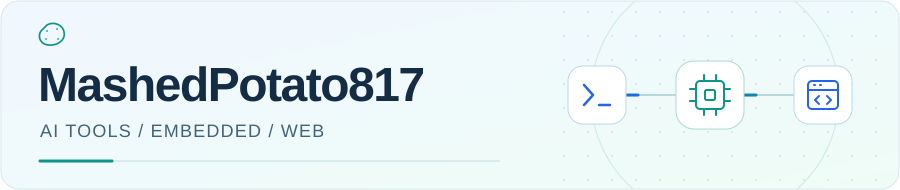
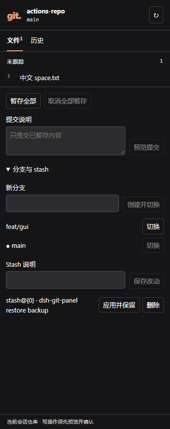
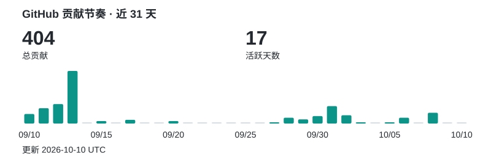

<picture>
  <source media="(prefers-reduced-motion: reduce) and (prefers-color-scheme: dark)" srcset="assets/profile-dark-static.svg">
  <source media="(prefers-reduced-motion: reduce)" srcset="assets/profile-light-static.svg">
  <source media="(prefers-color-scheme: dark)" srcset="assets/profile-dark.svg">
  <source media="(prefers-color-scheme: light)" srcset="assets/profile-light.svg">
  
</picture>

南京师范大学本科生，关注 AI 开发工具、嵌入式与 Web。

在这里分享项目实践、工具探索和学习记录。

[精选项目](#精选项目) · [入门指南](https://mashedpotato817.github.io/software-handbook/) · [全部仓库](https://github.com/MashedPotato817?tab=repositories)

## 精选项目

###  [dsh-git-plugin](https://github.com/MashedPotato817/dsh-git-plugin) · 开发工具

让 Git 工作流留在 DeepSeek Harness 会话里：Web Git 面板、5 个斜杠命令和 4 个模型只读工具，支持查看改动、管理分支与 stash，以及提交前检查。

[安装与使用](https://github.com/MashedPotato817/dsh-git-plugin/blob/main/README_ZH.md) · [面板指南](https://github.com/MashedPotato817/dsh-git-plugin/blob/main/docs/web-panel_ZH.md)

  
查看真实 Git 操作面板

  
独立测试仓库中的 DSH Web Git 面板，包含暂存、提交、分支与 stash 操作。点击截图查看原图。

  

###  [CargoTracker-STM32H7](https://github.com/MashedPotato817/CargoTracker-STM32H7) · 嵌入式应用

基于 STM32 的智能货物追踪系统。

###  [kexieweb](https://github.com/MashedPotato817/kexieweb) · Web 实践

校园科学技术协会网站，集中展示组织介绍、招新信息与活动资料。

## 近期关注

正在整理 [software-handbook](https://github.com/MashedPotato817/software-handbook)：面向 PC 新手的中文入门指南，从软件安装延伸到开发工具与 AI 工具的使用。

- [在线阅读](https://mashedpotato817.github.io/software-handbook/)：按软件与工具分类浏览，首批内容以 Windows 为主。
- [Git：Windows 安装、必要配置与验证](https://mashedpotato817.github.io/software-handbook/pages/git/install.html)：试写草稿，待维护者修改与人工安装验证。

## 技术栈

项目中使用与学习的技术：

**语言与 Web**

**嵌入式与机器学习**

## GitHub 活动

<a href="https://github.com/MashedPotato817?tab=overview">
  <picture>
    <source media="(max-width: 600px) and (prefers-color-scheme: dark)" srcset="assets/activity-dark-mobile.svg">
    <source media="(max-width: 600px)" srcset="assets/activity-light-mobile.svg">
    <source media="(prefers-color-scheme: dark)" srcset="assets/activity-dark.svg">
    <source media="(prefers-color-scheme: light)" srcset="assets/activity-light.svg">
    
  </picture>
</a>

欢迎交流开发工具、嵌入式与 Web 相关想法，也欢迎通过对应项目的 Issue 和 PR 参与讨论与改进。
